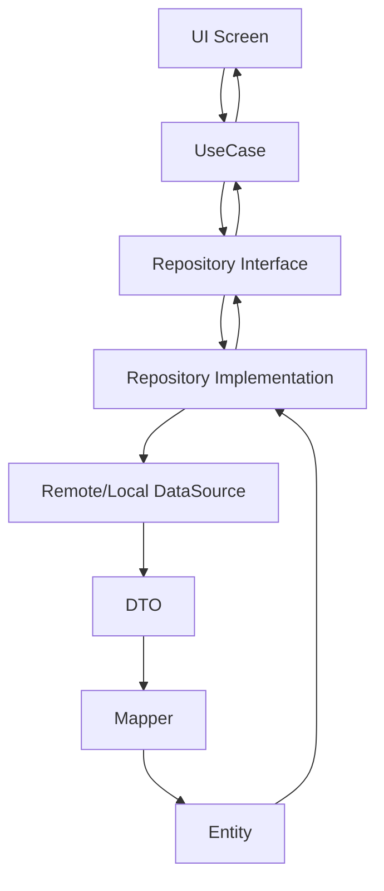

# Архитектура Flutter проекта

## Обзор

Проект следует **Clean Architecture** с **feature-first** организацией кода. Это обеспечивает:

- **Слабую связанность** (loose coupling)
- **Высокую тестируемость** (testability)
- **Масштабируемость** (scalability)
- **Поддержку** (maintainability)

## Принципы Clean Architecture

### Направление зависимостей

```
Presentation → Domain ← Data
```

Зависимости всегда указывают **внутрь** (к Domain layer):

- **Presentation** зависит от **Domain**
- **Data** зависит от **Domain**
- **Domain** не зависит ни от чего (pure Dart)

### Слои и их ответственность

#### Domain Layer (Бизнес-логика)

**Расположение:** `lib/features/<feature>/domain/`

**Содержит:**
- **Entities** — бизнес-объекты (immutable, camelCase)
- **Repository interfaces** — контракты для работы с данными
- **Use Cases** (Interactors) — отдельные бизнес-операции

**Запрещено:**
- ❌ Flutter/UI импорты
- ❌ HTTP/JSON зависимости
- ❌ DTOs и Mappers
- ❌ Реализации репозиториев

**Пример:**
```dart
// lib/features/property/domain/entities/property.dart
class Property {
  final String id;
  final String title;
  final int price;
  final int area;
  final int rooms;
  final String city;
  final String image;

  Property({
    required this.id,
    required this.title,
    required this.price,
    required this.area,
    required this.rooms,
    required this.city,
    required this.image,
  });
}

// lib/features/property/domain/repositories/property_repository.dart
abstract class PropertyRepository {
  Future<Either<Failure, List<Property>>> getProperties({
    required int page,
    required int limit,
    String? query,
    String? city,
  });
}

// lib/features/property/domain/use_cases/get_properties.dart
class GetProperties {
  final PropertyRepository repository;

  GetProperties(this.repository);

  Future<Either<Failure, List<Property>>> call({
    required int page,
    required int limit,
    String? query,
    String? city,
  }) {
    return repository.getProperties(
      page: page,
      limit: limit,
      query: query,
      city: city,
    );
  }
}
```

#### Data Layer (Данные и внешние сервисы)

**Расположение:** `lib/features/<feature>/data/`

**Содержит:**
- **DTOs** (Data Transfer Objects) — отражают формат API (snake_case)
- **Mappers** — конвертация DTO ↔ Entity
- **Repository implementations** — реализация интерфейсов из Domain
- **Data sources** (remote, local) — HTTP, SharedPreferences, SQLite

**Требования:**
- DTO поля должны точно соответствовать API (snake_case)
- Mappers централизуют конвертацию
- Репозитории используют Either<Failure, T> для ошибок

**Пример:**
```dart
// lib/features/property/data/dto/property_dto.dart
@JsonSerializable(fieldRename: FieldRename.snake)
class PropertyDto {
  final String id;
  final String title;
  final int price;
  final int area;
  final int rooms;
  final String city;
  final String image;

  PropertyDto({
    required this.id,
    required this.title,
    required this.price,
    required this.area,
    required this.rooms,
    required this.city,
    required this.image,
  });

  factory PropertyDto.fromJson(Map<String, dynamic> json) =>
      _$PropertyDtoFromJson(json);
  Map<String, dynamic> toJson() => _$PropertyDtoToJson(this);
}

// lib/features/property/data/mappers/property_mapper.dart
class PropertyMapper {
  static Property toEntity(PropertyDto dto) => Property(
        id: dto.id,
        title: dto.title,
        price: dto.price,
        area: dto.area,
        rooms: dto.rooms,
        city: dto.city,
        image: dto.image,
      );

  static PropertyDto fromEntity(Property entity) => PropertyDto(
        id: entity.id,
        title: entity.title,
        price: entity.price,
        area: entity.area,
        rooms: entity.rooms,
        city: entity.city,
        image: entity.image,
      );
}

// lib/features/property/data/repositories/property_repository_impl.dart
class PropertyRepositoryImpl implements PropertyRepository {
  final PropertyRemoteDataSource remoteDataSource;

  PropertyRepositoryImpl(this.remoteDataSource);

  @override
  Future<Either<Failure, List<Property>>> getProperties({
    required int page,
    required int limit,
    String? query,
    String? city,
  }) async {
    try {
      final dtos = await remoteDataSource.fetchProperties(
        page: page,
        limit: limit,
        query: query,
        city: city,
      );
      return Right(dtos.map(PropertyMapper.toEntity).toList());
    } on ServerException {
      return Left(ServerFailure());
    } on FormatException {
      return Left(ParseFailure());
    } catch (e) {
      return Left(UnexpectedFailure());
    }
  }
}

// lib/features/property/data/data_sources/property_remote_data_source.dart
class PropertyRemoteDataSource {
  final http.Client client;
  final String baseUrl;

  PropertyRemoteDataSource({required this.client, required this.baseUrl});

  Future<List<PropertyDto>> fetchProperties({
    required int page,
    required int limit,
    String? query,
    String? city,
  }) async {
    final params = {
      'page': page.toString(),
      'limit': limit.toString(),
      if (query != null && query.isNotEmpty) 'title': query,
      if (city != null && city.isNotEmpty) 'city': city,
    };

    final uri = Uri.parse(baseUrl).replace(queryParameters: params);
    final response = await client.get(uri);

    if (response.statusCode != 200) {
      throw ServerException('Failed to load properties');
    }

    final jsonList = json.decode(response.body) as List<dynamic>;
    return jsonList
        .map((json) => PropertyDto.fromJson(json as Map<String, dynamic>))
        .toList();
  }
}
```

#### Presentation Layer (UI и State Management)

**Расположение:** `lib/features/<feature>/presentation/`

**Содержит:**
- **Screens/Pages** — экраны приложения
- **Widgets** — переиспользуемые компоненты
- **State Management** — Provider/Bloc/Cubit (в соответствии с project.md)
- **ViewModels** (опционально)

**Правила:**
- Получает **Entities** из Use Cases
- Никогда не использует DTOs
- Бизнес-логика только в Domain
- UI содержит только логику отображения

**Пример (с Provider):**
```dart
// lib/features/property/presentation/providers/property_provider.dart
class PropertyProvider extends ChangeNotifier {
  final GetProperties getProperties;

  PropertyProvider({required this.getProperties});

  List<Property>? _properties;
  List<Property> get properties => _properties ?? [];

  bool _isLoading = false;
  bool get isLoading => _isLoading;

  Failure? _failure;
  Failure? get failure => _failure;

  Future<void> loadProperties({
    required int page,
    required int limit,
    String? query,
    String? city,
  }) async {
    _isLoading = true;
    _failure = null;
    notifyListeners();

    final result = await getProperties(
      page: page,
      limit: limit,
      query: query,
      city: city,
    );

    result.fold(
      (failure) {
        _failure = failure;
        _isLoading = false;
        notifyListeners();
      },
      (properties) {
        _properties = properties;
        _isLoading = false;
        notifyListeners();
      },
    );
  }
}

// lib/features/property/presentation/screens/property_screen.dart
class PropertyScreen extends ConsumerWidget {
  const PropertyScreen({super.key});

  @override
  Widget build(BuildContext context, WidgetRef ref) {
    final provider = ref.watch(propertyProvider);

    if (provider.isLoading && provider.properties.isEmpty) {
      return const Scaffold(
        body: Center(child: CircularProgressIndicator()),
      );
    }

    if (provider.failure != null) {
      return Scaffold(
        body: Center(
          child: Text(_mapFailureToMessage(provider.failure!)),
        ),
      );
    }

    return Scaffold(
      appBar: AppBar(title: const Text('Properties')),
      body: ListView.builder(
        itemCount: provider.properties.length,
        itemBuilder: (context, index) {
          final property = provider.properties[index];
          return PropertyCard(property: property);
        },
      ),
    );
  }

  String _mapFailureToMessage(Failure failure) {
    if (failure is ServerFailure) {
      return 'Ошибка сервера. Попробуйте позже.';
    }
    if (failure is ParseFailure) {
      return 'Ошибка обработки данных.';
    }
    return 'Неизвестная ошибка';
  }
}
```

## Data Flow (Полный цикл)

```
UI (Screen) 
  ↓ (вызывает UseCase)
UseCase (Domain)
  ↓ (вызывает Repository интерфейс)
Repository Implementation (Data)
  ↓ (использует DataSource)
Remote/Local DataSource
  ↓ (возвращает DTO)
DTO → Mapper → Entity
  ↓ (возвращает через Repository)
Either<Failure, Entity>
  ↓ (через UseCase)
UI (отображает результат)
```

**Визуализация:**


## Feature-First Структура

```
lib/
├── core/                          # Общие модули
│   ├── theme/                    # Тема и стили
│   ├── router/                   # Навигация
│   ├── network/                  # HTTP клиент, интерцепторы
│   ├── di/                       # Dependency Injection (GetIt)
│   ├── error/                    # Failure классы
│   └── utils/                    # Утилиты
├── features/
│   └── <feature_name>/
│       ├── data/
│       │   ├── dto/
│       │   ├── mappers/
│       │   ├── data_sources/
│       │   ├── repositories/
│       │   └── models/           # (опционально) локальные модели
│       ├── domain/
│       │   ├── entities/
│       │   ├── repositories/
│       │   └── use_cases/
│       └── presentation/
│           ├── screens/
│           ├── widgets/
│           ├── providers/        # или bloc/, cubit/
│           └── view_models/
└── main.dart                     # Точка входа, DI инициализация
```

## DTO и Mapper Rules

### DTO (Data Transfer Object)

- **Имя:** `EntityNameDto` (например, `PropertyDto`)
- **Расположение:** `lib/features/<feature>/data/dto/`
- **Поля:** snake_case (как в API)
- **Аннотации:** `@JsonSerializable(fieldRename: FieldRename.snake)`
- **Иммутабельность:** все поля final
- **Конструкторы:** `fromJson`, `toJson`

### Mapper

- **Имя:** `EntityNameMapper` (например, `PropertyMapper`)
- **Расположение:** `lib/features/<feature>/data/mappers/`
- **Методы:**
  - `static Entity toEntity(Dto dto)`
  - `static Dto fromEntity(Entity entity)`
- **Централизация:** все конвертации в одном месте

### Entity (Domain)

- **Имя:** `EntityName` (например, `Property`)
- **Расположение:** `lib/features/<feature>/domain/entities/`
- **Поля:** camelCase (Dart стиль)
- **Иммутабельность:** все поля final
- **Без аннотаций:** не зависит от JSON/сериализации

## State Management (Provider)

Проект использует **Provider** как единый state manager.

### Правила:

1. **Только Provider** — не смешивать с Bloc/Riverpod
2. **ChangeNotifier** — базовый класс для провайдеров
3. **ConsumerWidget** — для доступа к состоянию
4. **MultiProvider** — в main.dart для регистрации провайдеров
5. **Логика состояния** — в провайдере, не в UI
6. **Use Cases** — вызываются из провайдера

### Структура провайдера:

```dart
class FeatureProvider extends ChangeNotifier {
  // Зависимости (Use Cases)
  final GetSomething getSomething;

  // Состояние
  List<Entity>? _items;
  bool _isLoading = false;
  Failure? _failure;

  // Геттеры
  List<Entity> get items => _items ?? [];
  bool get isLoading => _isLoading;
  Failure? get failure => _failure;

  // Методы изменения состояния
  Future<void> load() async {
    _isLoading = true;
    _failure = null;
    notifyListeners();

    final result = await getSomething();
    result.fold(
      (f) {
        _failure = f;
        _isLoading = false;
      },
      (items) {
        _items = items;
        _isLoading = false;
      },
    );
    notifyListeners();
  }
}
```

## Dependency Injection (GetIt)

Используется **GetIt** для инъекции зависимостей.

### Инициализация:

```dart
// lib/core/di/service_locator.dart
final getIt = GetIt.instance;

void setupServiceLocator() {
  // Data layer
  getIt.registerLazySingleton<http.Client>(() => http.Client());
  getIt.registerLazySingleton<PropertyRemoteDataSource>(
    () => PropertyRemoteDataSource(
      client: getIt<http.Client>(),
      baseUrl: getIt<String>(instanceName: 'apiBaseUrl'),
    ),
  );
  getIt.registerLazySingleton<PropertyRepository>(
    () => PropertyRepositoryImpl(getIt<PropertyRemoteDataSource>()),
  );

  // Domain layer
  getIt.registerLazySingleton<GetProperties>(
    () => GetProperties(getIt<PropertyRepository>()),
  );

  // Presentation layer
  getIt.registerFactory<PropertyProvider>(
    () => PropertyProvider(getProperties: getIt<GetProperties>()),
  );
}
```

### Использование в main.dart:

```dart
void main() {
  setupServiceLocator();
  
  runApp(
    MultiProvider(
      providers: [
        ChangeNotifierProvider(
          create: (_) => getIt<PropertyProvider>(),
        ),
      ],
      child: const MyApp(),
    ),
  );
}
```

## Обработка ошибок (Either<Failure, T>)

Используется **Dartz** для функционального подхода к ошибкам.

### Failure иерархия:

```dart
// lib/core/error/failure.dart
abstract class Failure {
  final String message;
  Failure(this.message);
}

class ServerFailure extends Failure {
  ServerFailure([super.message = 'Ошибка сервера']);
}

class ParseFailure extends Failure {
  ParseFailure([super.message = 'Ошибка парсинга']);
}

class NetworkFailure extends Failure {
  NetworkFailure([super.message = 'Ошибка сети']);
}

class UnexpectedFailure extends Failure {
  UnexpectedFailure([super.message = 'Неизвестная ошибка']);
}
```

### Исключения в Data layer:

```dart
// lib/core/error/exceptions.dart
class ServerException implements Exception {
  final String message;
  ServerException([this.message = 'Server error']);
}

class FormatException implements Exception {
  final String message;
  FormatException([this.message = 'Format error']);
}
```

### Паттерн:

```dart
// В Repository
Future<Either<Failure, T>> method() async {
  try {
    final result = await dataSource.method();
    return Right(result);
  } on ServerException {
    return Left(ServerFailure());
  } catch (e) {
    return Left(UnexpectedFailure());
  }
}
```

## Конфигурация API

API конфигурация выносится в отдельный файл:

```dart
// lib/core/config/app_config.dart
class AppConfig {
  static const String apiBaseUrl = String.fromEnvironment(
    'API_BASE_URL',
    defaultValue: 'https://api.example.com',
  );

  static const int defaultPageSize = 20;
}
```

Или через `.env` файл с `flutter_dotenv`:

```dart
// .env
API_BASE_URL=https://api.example.com
DEFAULT_PAGE_SIZE=20
```

## Тестирование

### Unit Tests

- **Use Cases** — тестирование бизнес-логики
- **Repositories** — с моками DataSources
- **Entities** — валидация
- **Mappers** — конвертация DTO ↔ Entity

**Расположение:** `test/unit/features/<feature>/`

### Widget Tests

- **Screens** — все состояния (loading, success, error, empty)
- **Widgets** — рендеринг и взаимодействия
- **Providers** — state transitions

**Расположение:** `test/widget/features/<feature>/`

### Integration Tests

- Критические пользовательские сценарии
- Полные потоки (например, загрузка и отображение списка)

**Расположение:** `integration_test/`

## Правила кодирования

- Следовать **Effective Dart** и **dart style**
- trailing commas для multi-line collections
- `final` по умолчанию, `const` где возможно
- Имена: PascalCase (классы), camelCase (переменные/методы), snake_case (файлы)
- Boolean переменные: `is`, `has`, `can`, `should`
- Комментарии `///` объясняют **почему**, а не **что**

## Summary Checklist

- ✅ Clean Architecture (Presentation → Domain ← Data)
- ✅ Feature-first структура
- ✅ Domain: Entities, Repository interfaces, Use Cases
- ✅ Data: DTOs (snake_case), Mappers, Repository impl, DataSources
- ✅ Presentation: Entities только, Provider/Bloc, UI логика
- ✅ DTO ↔ Entity через Mapper
- ✅ Either<Failure, T> для ошибок
- ✅ GetIt для DI
- ✅ Конфигурация API вынесена
- ✅ Тестирование: unit, widget, integration

## Related Documentation

- [`project.md`](project.md) — конфигурация проекта и правила
- [`testing.md`](testing.md) — стратегия тестирования
- [`CHANGES_OVERVIEW.md`](CHANGES_OVERVIEW.md) — история архитектурных решений
- [`docs/features/property.md`](docs/features/property.md) — пример реализации feature
